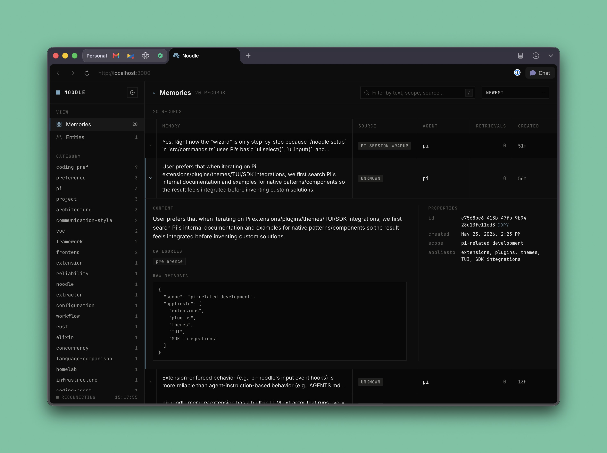

# pi-noodle

Long-term memory for Pi, powered by a local [libSQL](https://turso.tech/libsql) database with vector similarity search.



## Quick start

```bash
# Install as a Pi extension
pi install pi-noodle

# In Pi, configure interactively
/noodle settings
```

The setup screen shows the full config on one page:
1. Database mode — local file or Turso Cloud
2. Embedding provider — OpenAI, LM Studio, Ollama, or custom
3. Relevant fields update in place as you switch modes/providers
4. Required fields are validated before save

Settings are saved to `~/.pi/noodle/config.json` — memories travel with you across all projects.

## `/noodle` command

```
/noodle                  Show current config (paths, endpoint, masked API key)
/noodle remember <text>  Save a memory directly
/noodle forget <query>   Find and delete a memory
/noodle edit <query>     Find and update a memory
/noodle review           Review recent auto-saved memories
/noodle settings         Interactive single-screen configuration editor with validation
/noodle setup            Alias for /noodle settings
/noodle init             Create a default config file for manual editing
/noodle web              Start the Memory Explorer (auto-stops when all tabs close)
/noodle web stop         Stop the explorer immediately
/noodle web dev          Dev mode — hot reload on save, use web stop when done
/noodle web 8080         Start on a custom port
```

For UI development outside Pi, run `npm run web:dev` from the repo — it connects to your configured database and reloads the browser whenever you edit `src/web/index.html`.

### Memory Explorer Web UI

Launch a dark-themed web interface to browse, search, and visualize your memories:

- **Live stats** — total memories, categories, scopes
- **Category filter** — dropdown of all stored categories
- **Text search** — substring matching on memory text
- **Dark mode** — GitHub-inspired color scheme

Run `/noodle web` in Pi to open the explorer in your browser. The server runs in a background process and **shuts down automatically ~2 seconds after you close all tabs**. Use `/noodle web stop` to kill it manually.

## Config file

`~/.pi/noodle/config.json`:

```json
{
  "db": {
    "mode": "local",
    "path": "/Users/you/.pi/noodle/memories.db"
  },
  "embedding": {
    "provider": "openai",
    "apiKey": "sk-...",
    "baseUrl": "https://api.openai.com/v1",
    "model": "text-embedding-3-small"
  }
}
```

### Cloud mode (Turso)

```json
{
  "db": {
    "mode": "cloud",
    "url": "libsql://my-db-org.turso.io",
    "authToken": "eyJ..."
  },
  "embedding": {
    "provider": "openai",
    "apiKey": "sk-...",
    "baseUrl": "https://api.openai.com/v1",
    "model": "text-embedding-3-small"
  }
}
```

## Environment variable overrides

Env vars take priority over the config file:

| Variable | Overrides |
|---|---|
| `NOODLE_CONFIG_PATH` | Config file location |
| `NOODLE_DB_PATH` | Local DB path |
| `NOODLE_DB_URL` | Cloud DB URL |
| `NOODLE_DB_TOKEN` | Cloud DB auth token |
| `OPENAI_API_KEY` | Embedding API key |
| `EMBEDDING_BASE_URL` | Embedding endpoint URL |
| `EMBEDDING_MODEL` | Embedding model name |

## Architecture

```
MemoryService (dedupe, heuristics, auto-capture)
       │
  MemoryBackend (interface)
       │
  TursoBackend
       │
  ├── libSQL (local file or Turso Cloud)
  └── Embedder (OpenAI / LM Studio / Ollama / any /v1/embeddings)
```

### What gets stored

Every memory is a row in SQLite with `text`, `embedding` (F32_BLOB), `category`, `categories`, `scope` (userId/assistantId/sessionId), and arbitrary `metadata`.

### Search

Vector similarity via `vector_distance_cos()` in libSQL, ranked by cosine distance, post-filtered by category and threshold.

### Heuristics

`MemoryService.policy.ts` classifies messages, tracks repetition (3× threshold), and auto-saves durable memories without explicit user commands.

## File layout

```
src/
├── config.ts              # Config resolution (~/.pi/noodle/config.json + env vars)
├── config-screen.ts       # Flat single-screen config editor for /noodle settings
├── constants.ts           # DEFAULT_AGENT_ID
├── types.ts               # NoodleConfig, JsonObject, NotificationTarget, etc.
├── utils.ts               # maskSecret, describeError, formatJson, extractTextContent
├── commands.ts            # /noodle command + interactive setup entrypoint
├── extension.ts           # Pi extension lifecycle hooks
├── tools.ts               # memory_add / search / list / get / update / delete
├── session.ts             # Session message collection
├── queue.ts               # Sequential async write queue
├── notifications.ts       # UI notification helpers
└── memory/
    ├── backend.ts         # MemoryBackend interface
    ├── types.ts           # MemoryRecord, MemoryScope, etc.
    ├── turso-backend.ts   # TursoBackend (libSQL + vector search)
    ├── embedder.ts        # Embedder type
    ├── embedders/         # openai.ts, lm-studio.ts
    ├── service.ts         # MemoryService (dedupe, scoring, auto-capture)
    ├── policy.ts          # Heuristics (classification, repetition, retrieval)
    └── runtime.ts         # Wiring (config + TursoBackend + MemoryService)
```
